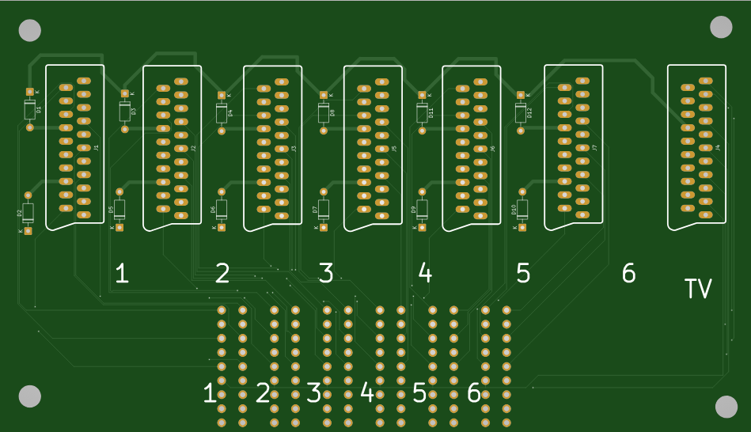
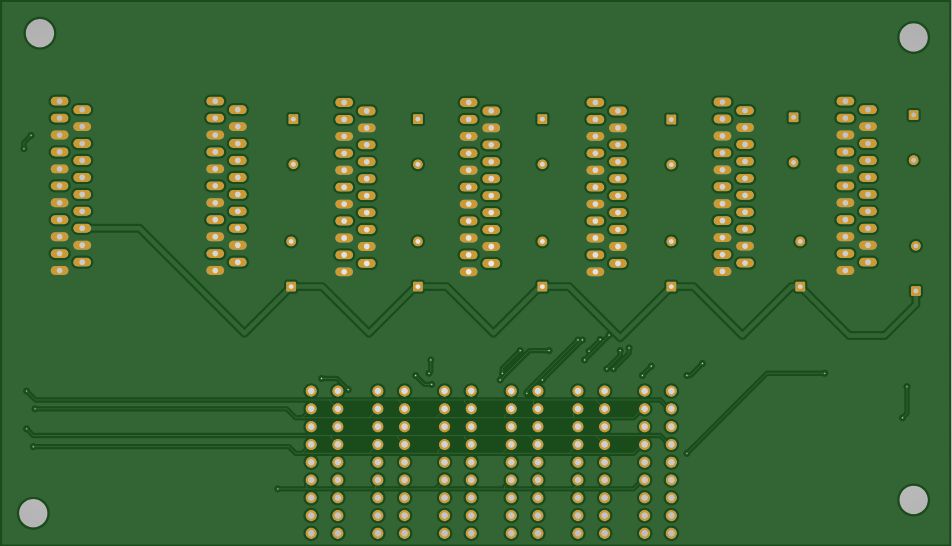

# SCARTiera
Mechanical multiSCART adapter with 6 positions.  

Due to a lack of options of multi-scart adapters ready to buy (always either out of stock, with only three positions or too expensive), i made one myself by reverse engineering a simpler three-positions adapter.  
This is a hobby project, and contributions, suggestions, and feedback are all very welcome.  
This design is currently **untested**, so build this at your own risk.

